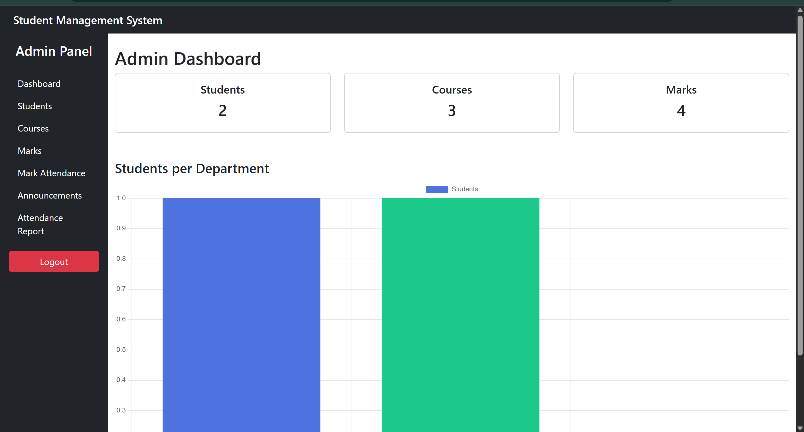
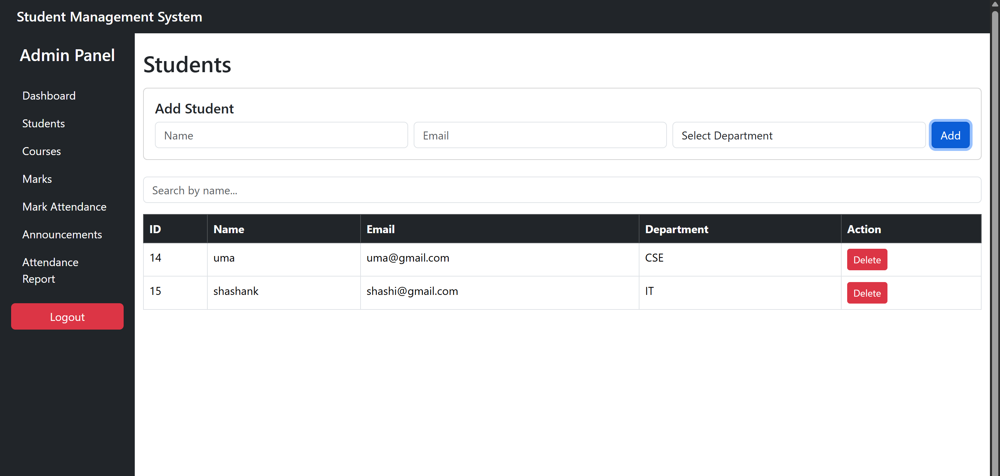
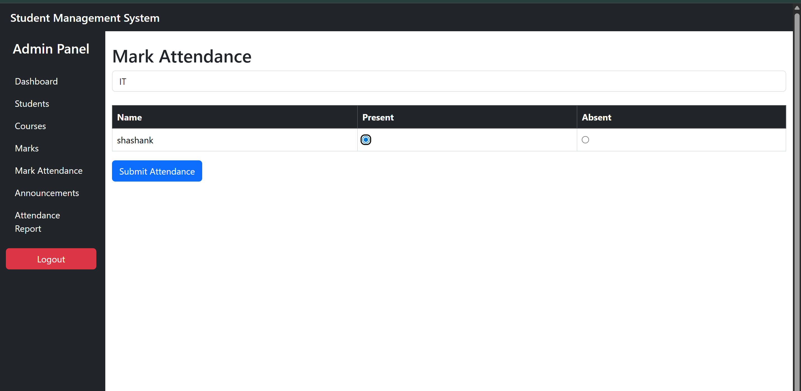
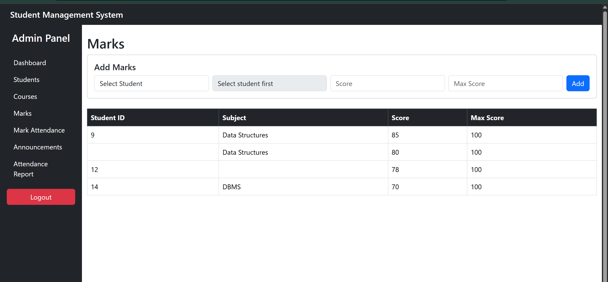
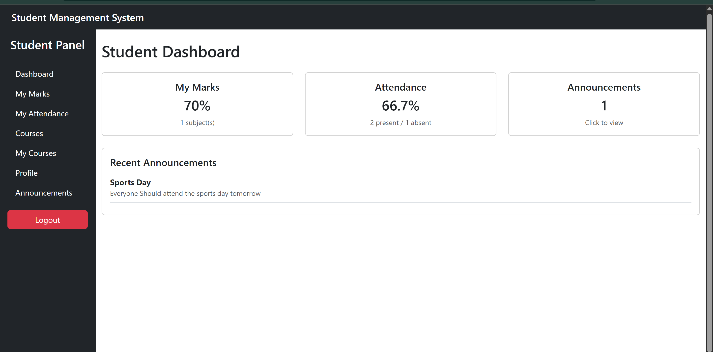
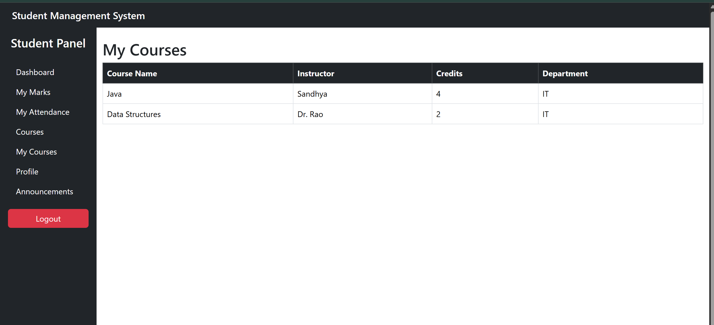
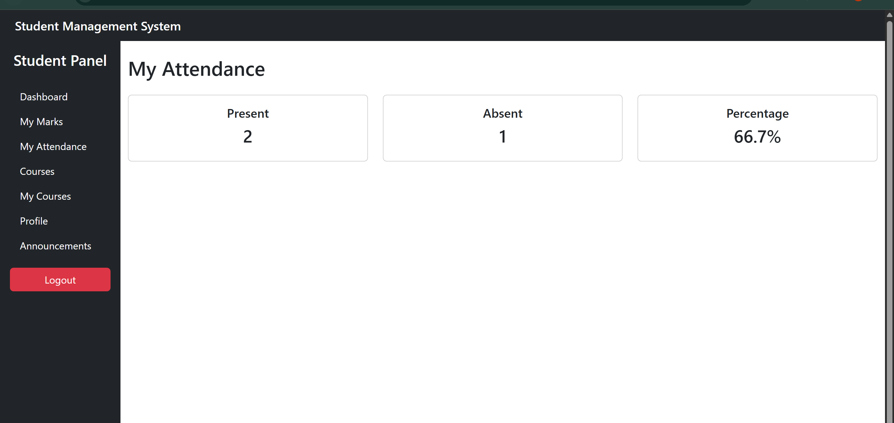
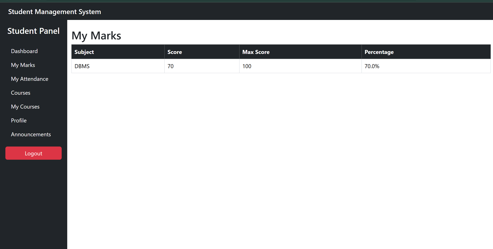

# Student Management System

A full-stack web application for managing students, courses, marks, and attendance — built with **Spring Boot** on the backend and **React** on the frontend.

---

## 📸 Screenshots

### 👨‍💼 Admin

<p align="center">
  <b>Admin Dashboard</b> &nbsp;&nbsp;&nbsp;&nbsp;&nbsp;&nbsp;&nbsp;&nbsp;&nbsp;&nbsp;&nbsp;&nbsp;&nbsp;&nbsp;&nbsp;&nbsp;&nbsp;&nbsp;&nbsp;&nbsp;&nbsp;&nbsp;&nbsp;&nbsp;&nbsp;&nbsp;&nbsp;&nbsp;&nbsp;&nbsp;
  <b>Students Page</b>
</p>

<p align="center">
  
  
</p>

<p align="center">
  <b>Attendance</b> &nbsp;&nbsp;&nbsp;&nbsp;&nbsp;&nbsp;&nbsp;&nbsp;&nbsp;&nbsp;&nbsp;&nbsp;&nbsp;&nbsp;&nbsp;&nbsp;&nbsp;&nbsp;&nbsp;&nbsp;&nbsp;&nbsp;&nbsp;&nbsp;&nbsp;&nbsp;&nbsp;&nbsp;&nbsp;&nbsp;
  <b>Marks</b>
</p>


<p align="center">
  
  
</p>

---

### 🎓 Student

<p align="center">
  <b>Student Dashboard</b> &nbsp;&nbsp;&nbsp;&nbsp;&nbsp;&nbsp;&nbsp;&nbsp;&nbsp;&nbsp;&nbsp;&nbsp;&nbsp;&nbsp;&nbsp;&nbsp;&nbsp;&nbsp;&nbsp;&nbsp;&nbsp;&nbsp;&nbsp;&nbsp;&nbsp;&nbsp;&nbsp;&nbsp;
  <b>My Courses</b>
</p>

<p align="center">
  
  
</p>


<p align="center">
  <b>My Attendance</b> &nbsp;&nbsp;&nbsp;&nbsp;&nbsp;&nbsp;&nbsp;&nbsp;&nbsp;&nbsp;&nbsp;&nbsp;&nbsp;&nbsp;&nbsp;&nbsp;&nbsp;&nbsp;&nbsp;&nbsp;&nbsp;&nbsp;&nbsp;&nbsp;&nbsp;&nbsp;&nbsp;
  <b>My Marks</b>
</p>

<p align="center">
  
  
</p>


---

## Table of Contents

- [Overview](#overview)
- [Tech Stack](#tech-stack)
- [Features](#features)
- [Project Structure](#project-structure)
- [Getting Started](#getting-started)
  - [Prerequisites](#prerequisites)
  - [Backend Setup](#backend-setup)
  - [Frontend Setup](#frontend-setup)
- [Environment Variables](#environment-variables)
- [Authentication Flow](#authentication-flow)
- [API Reference](#api-reference)
- [Suggested Improvements](#suggested-improvements)

---

## Overview

The Student Management System (SMS) provides two user roles — **Admin** and **Student** — each with their own dashboard and set of capabilities.

Admins manage the full institution: students, courses, subjects, marks, attendance, and announcements. Students get a personalised view of their academic profile — marks, attendance percentage, enrolled courses, and announcements.

Authentication is stateless JWT-based. All protected routes are secured at both the Spring Security layer and via `@PreAuthorize` on individual endpoints. First-time student logins are forced through a password change before accessing the system.

---

## Tech Stack

**Backend**
- Java 17 + Spring Boot 3
- Spring Security 6 + JWT (jjwt)
- Spring Data JPA + Hibernate
- MySQL
- Maven

**Frontend**
- React 18
- React Router v6
- Axios
- Bootstrap 5
- Chart.js + react-chartjs-2
- jwt-decode

---

## Features

### Admin
- Add, update, delete, and search students with live name filtering
- Create and delete courses with department assignment
- Assign marks per student per subject (subjects loaded dynamically by department)
- Mark daily attendance by department with present/absent radio buttons and duplicate protection
- View attendance reports — daily summary, department breakdown, and full record list
- Post announcements
- Dashboard with live student/course/marks stats and a students-per-department bar chart

### Student
- Forced password change on first login
- Dashboard showing average marks, attendance percentage, and recent announcements
- View full marks breakdown with per-subject percentage
- View attendance summary (present days, absent days, percentage)
- Browse and enroll in available courses (duplicate enrollment prevented)
- View enrolled courses with full course details
- View all announcements
- View personal profile

---

## Project Structure

```
sms/
├── backend/
│   └── src/main/java/com/shashank/sms/
│       ├── config/
│       │   ├── CorsConfig.java
│       │   └── SecurityConfig.java
│       ├── controller/
│       │   ├── AuthController.java
│       │   ├── AttendanceController.java
│       │   ├── AnnouncementController.java
│       │   ├── CourseController.java
│       │   ├── DashboardController.java
│       │   ├── EnrollmentController.java
│       │   ├── MarksController.java
│       │   ├── StudentController.java
│       │   └── SubjectController.java
│       ├── dto/
│       ├── entity/
│       ├── exception/
│       │   ├── GlobalExceptionHandler.java
│       │   └── ResourceNotFoundException.java
│       ├── repository/
│       ├── security/
│       │   ├── JwtFilter.java
│       │   └── JwtUtil.java
│       └── service/
│           ├── AttendanceService.java
│           ├── AuthService.java
│           ├── CustomUserDetailsService.java
│           ├── MarksService.java
│           └── StudentService.java
│
└── frontend/
    └── src/
        ├── components/
        │   ├── DashboardCharts.js
        │   ├── Navbar.js
        │   ├── PrivateRoute.js
        │   ├── Sidebar.js
        │   └── StudentSidebar.js
        ├── pages/
        │   ├── AdminDashboard.js
        │   ├── Announcements.js
        │   ├── Attendance.js
        │   ├── ChangePassword.js
        │   ├── Courses.js
        │   ├── Login.js
        │   ├── MarkAttendance.js
        │   ├── Marks.js
        │   ├── MyAttendance.js
        │   ├── MyCourses.js
        │   ├── MyMarks.js
        │   ├── Profile.js
        │   ├── StudentDashboard.js
        │   └── Students.js
        └── services/
            └── api.js
```

---

## Getting Started

### Prerequisites

- Java 17+
- Node.js 18+ and npm
- MySQL 8+
- Maven 3.8+

### Backend Setup

1. Clone the repository:
   ```bash
   git clone https://github.com/Maralishashank/student-management-system.git
   cd student-management-system/backend
   ```

2. Create a MySQL database:
   ```sql
   CREATE DATABASE sms_db;
   ```

3. Configure `src/main/resources/application.properties`:
   ```properties
   spring.datasource.url=jdbc:mysql://localhost:3306/sms_db
   spring.datasource.username=your_db_user
   spring.datasource.password=your_db_password
   spring.jpa.hibernate.ddl-auto=update
   spring.jpa.show-sql=false
   ```

4. Run the application:
   ```bash
   mvn spring-boot:run
   ```
   The API will be available at `http://localhost:8080`.

5. Create an admin account (run once after first start):
   ```bash
   curl -X POST http://localhost:8080/auth/register \
     -H "Content-Type: application/json" \
     -d '{"username":"admin","password":"admin123","role":"ADMIN","firstLogin":false}'
   ```

### Frontend Setup

1. Navigate to the frontend directory:
   ```bash
   cd sms/frontend
   ```

2. Install dependencies:
   ```bash
   npm install
   ```

3. Start the development server:
   ```bash
   npm start
   ```
   The app will be available at `http://localhost:3000`.

---

## Environment Variables

The API base URL is set in `src/services/api.js`. For production use an environment variable:

```js
baseURL: process.env.REACT_APP_API_URL || "http://localhost:8080"
```

Create a `.env` file in the frontend root:
```
REACT_APP_API_URL=https://your-api-domain.com
```

The JWT secret is currently in `JwtUtil.java`. Before deploying, move it to `application.properties`:
```properties
jwt.secret=your-strong-secret-key-minimum-32-characters
```
Then inject it with `@Value("${jwt.secret}")`.

---

## Authentication Flow

**Normal login:**
1. User submits credentials to `POST /auth/login`
2. Server authenticates and returns a signed JWT containing `username`, `role`, and `firstLogin` claims
3. Frontend stores the token in `localStorage` and attaches it to every request via an Axios interceptor
4. `JwtFilter` validates the token and populates the Spring Security context on each request
5. Role-based access is enforced via `SecurityConfig` (path-level) and `@PreAuthorize` (method-level)
6. A 401 response interceptor in `api.js` automatically clears the token and redirects to login when it expires

**First-login flow:**
1. When a student is added by an admin, their account is created with the default password `student123` and `firstLogin = true`
2. On first login the server returns a short-lived JWT (15 minutes) with `firstLogin: true` in the claims
3. The frontend detects this claim and redirects to `/change-password`
4. The student sets a new password — the first-login token authenticates this call to `POST /auth/change-password`
5. The server clears `firstLogin = false` and the student logs in fresh with their new password

---

## API Reference

All protected endpoints require:
```
Authorization: Bearer <jwt_token>
```

### Auth

| Method | Endpoint | Access | Description |
|--------|----------|--------|-------------|
| POST | `/auth/register` | Public | Register a new user |
| POST | `/auth/login` | Public | Login — returns JWT |
| POST | `/auth/change-password` | Authenticated | Change password (works with first-login token) |

### Students

| Method | Endpoint | Access | Description |
|--------|----------|--------|-------------|
| GET | `/students` | Admin | All students (paginated) |
| POST | `/students` | Admin | Add student — auto-creates login account |
| GET | `/students/{id}` | Admin | Get student by ID |
| PUT | `/students/{id}` | Admin | Update student |
| DELETE | `/students/{id}` | Admin | Delete student |
| GET | `/students/department/{dept}` | Admin | Filter by department |
| GET | `/students/department-count` | Admin | Count per department (CSE / IT / ECE) |
| GET | `/students/me` | Student | Own profile |

### Courses

| Method | Endpoint | Access | Description |
|--------|----------|--------|-------------|
| GET | `/courses` | Authenticated | All courses |
| POST | `/courses` | Admin | Create course |
| DELETE | `/courses/{id}` | Admin | Delete course |

### Enrollment

| Method | Endpoint | Access | Description |
|--------|----------|--------|-------------|
| POST | `/enroll/{courseId}` | Student | Enroll in a course (duplicate-safe) |
| GET | `/enroll/my` | Student | My enrollments |

### Marks

| Method | Endpoint | Access | Description |
|--------|----------|--------|-------------|
| GET | `/marks` | Admin | All marks |
| POST | `/marks` | Admin | Add marks for a student |
| GET | `/marks/my` | Student | Own marks |

### Attendance

| Method | Endpoint | Access | Description |
|--------|----------|--------|-------------|
| POST | `/attendance/mark` | Admin | Mark attendance (duplicate-safe) |
| GET | `/attendance/all` | Admin | All attendance records |
| GET | `/attendance/report?date=YYYY-MM-DD` | Admin | Daily report |
| GET | `/attendance/department-report` | Admin | Present count by department |
| GET | `/attendance/my` | Student | Own attendance summary |

### Subjects

| Method | Endpoint | Access | Description |
|--------|----------|--------|-------------|
| GET | `/subjects` | Authenticated | All subjects |
| POST | `/subjects` | Admin | Add subject |
| GET | `/subjects/department/{dept}` | Admin, Student | Subjects by department |

### Announcements

| Method | Endpoint | Access | Description |
|--------|----------|--------|-------------|
| GET | `/announcements` | Authenticated | All announcements |
| POST | `/announcements` | Admin | Create announcement |

### Dashboard

| Method | Endpoint | Access | Description |
|--------|----------|--------|-------------|
| GET | `/dashboard/stats` | Authenticated | Total students, courses, and marks count |

---

## Suggested Improvements

**Security**
- Move the JWT secret from source code into `application.properties` or an environment variable before any deployment
- Add a token refresh endpoint so long sessions don't force re-login
- Add rate limiting on `POST /auth/login` to prevent brute-force attacks

**Backend**
- Add pagination to marks and attendance endpoints — they currently return full lists which won't scale
- Add an edit endpoint for marks so admins can correct mistakes without deleting and re-adding
- Add a delete endpoint for announcements
- Replace the hardcoded department list (CSE / IT / ECE) with a `Department` entity so new departments can be added without code changes
- Add a unique constraint on `Enrollment(studentId, courseId)` at the database level — the app checks it but the DB doesn't enforce it
- Add database indexes on `Attendance.studentId`, `Attendance.date`, and `Marks.studentId` for query performance
- Write unit tests for services (JUnit 5 + Mockito) and integration tests for controllers (Spring Boot Test + Testcontainers)

**Frontend**
- Add an edit flow for students — currently only add and delete exist
- Add pagination controls to the Students table (the backend already supports it via the `Pageable` param)
- Replace `window.alert()` calls with toast notifications (e.g. react-hot-toast) for a better UX
- Move the API base URL from `api.js` into a `.env` file
- Add a 404 Not Found page for unmatched routes in `App.js`
- Consider React Query or SWR for data fetching to get automatic caching and background re-fetching

---

## License

This project is licensed under the MIT License.
