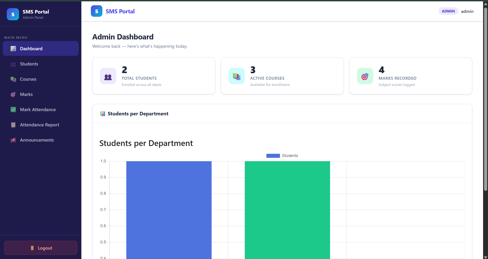
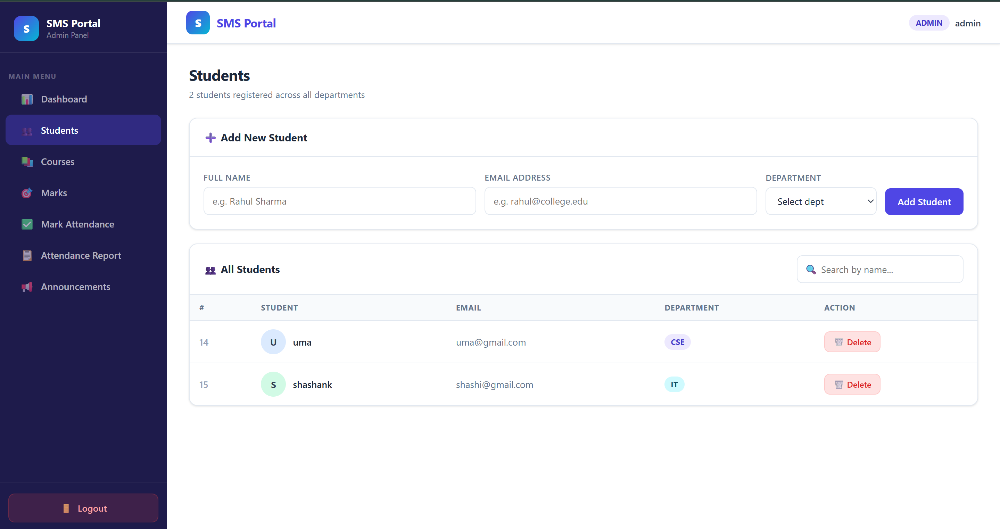
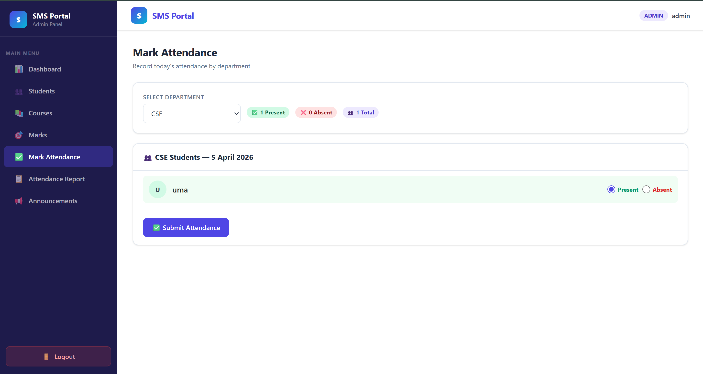
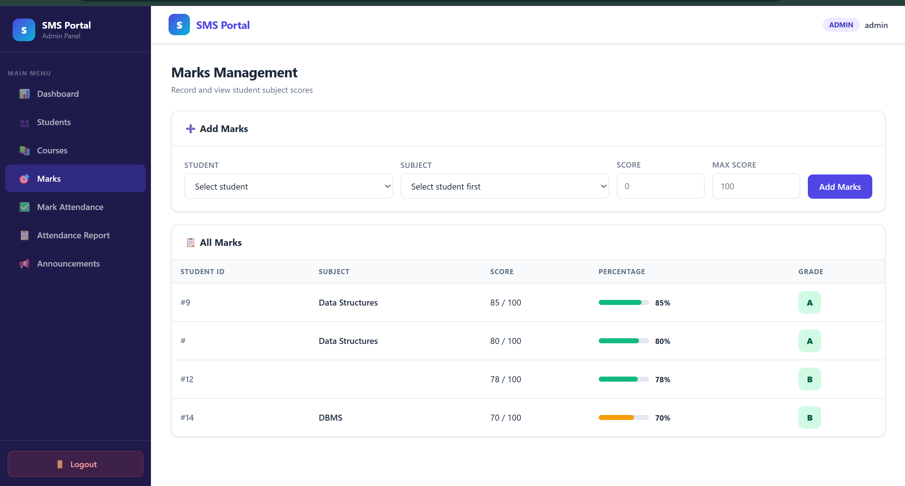
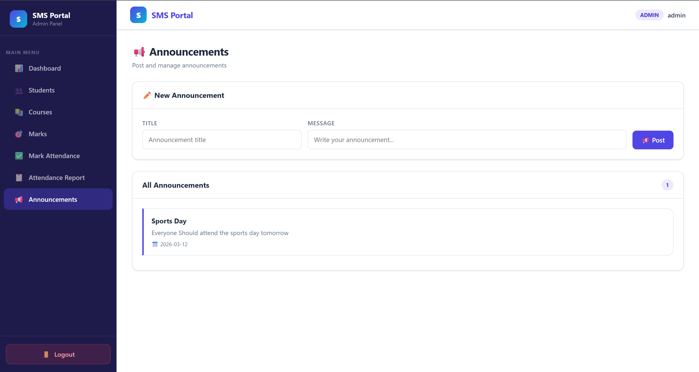
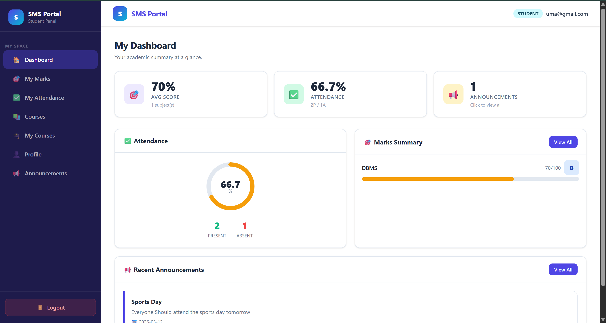
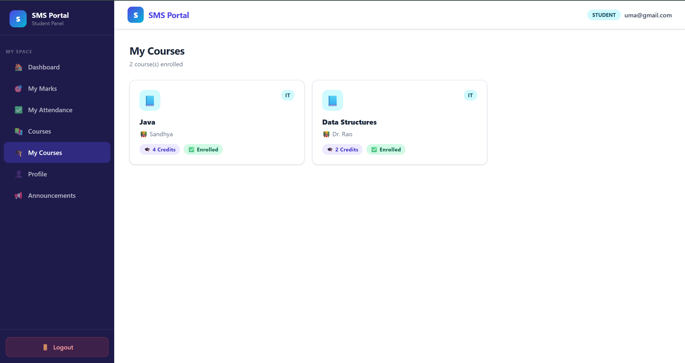
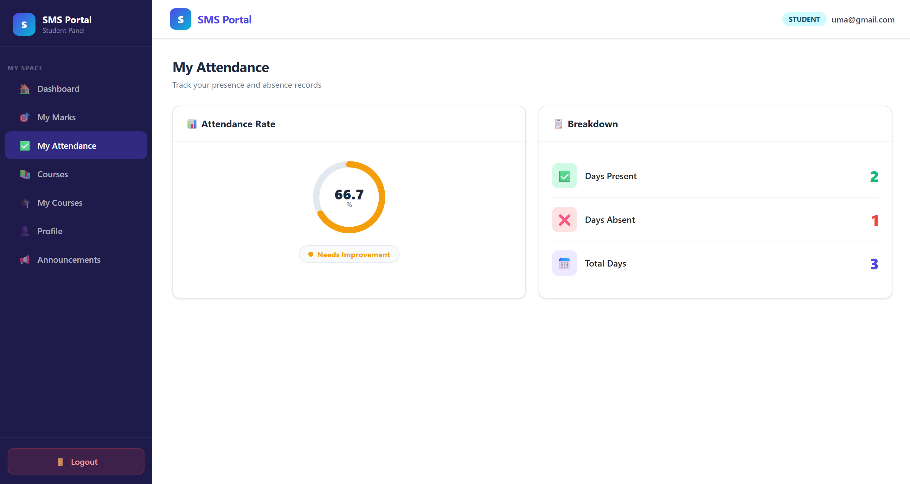
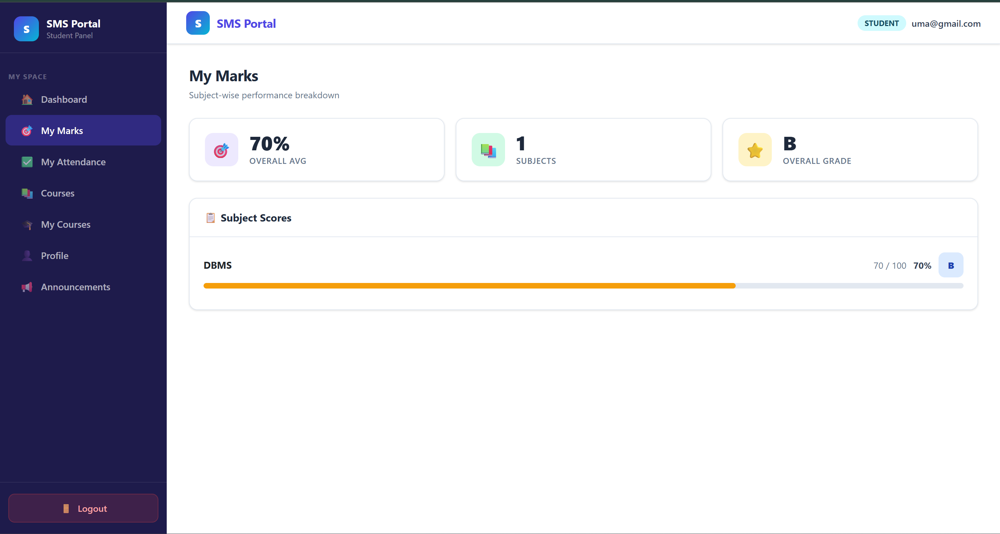

# Student Management System

> A full-stack web application for managing students, courses, marks, and attendance — built with **Spring Boot** and **React**.

---

🔗 **Live Demo:** [https://student-management-system-self-one.vercel.app](https://student-management-system-self-one.vercel.app)

📁 **Repository:** [github.com/Maralishashank/student-management-system](https://github.com/Maralishashank/student-management-system)

---

## 📸 Screenshots

### 🔐 Authentication

| Login Page |
|------------|
|  |

---

### 👨‍💼 Admin Panel

| Dashboard | Students |
|----------|----------|
|  |  |

| Attendance | Marks |
|------------|-------|
|  |  |

| Announcements |
|--------------|
|  |

---

### 🎓 Student Panel

| Dashboard | My Courses |
|----------|------------|
|  |  |

| My Attendance | My Marks |
|---------------|----------|
|  |  |


---

## Demo Credentials

| Role | Username | Password | Notes |
|------|----------|----------|-------|
| Admin | `admin` | `admin123` | Auto-seeded on first startup |
| Student | *(student email)* | `student123` | Add a student first — their email becomes the username |

> Students are prompted to change their default password on first login.

---

## Table of Contents

- [Overview](#overview)
- [Tech Stack](#tech-stack)
- [Features](#features)
- [Project Structure](#project-structure)
- [Getting Started](#getting-started)
- [Environment Variables](#environment-variables)
- [Authentication Flow](#authentication-flow)
- [API Reference](#api-reference)
- [Suggested Improvements](#suggested-improvements)

---

## Overview

The Student Management System (SMS) provides two user roles — **Admin** and **Student** — each with their own dashboard and capabilities.

Admins manage the full institution: students, courses, subjects, marks, attendance, and announcements. Students get a personalised academic profile — marks with grade letters, attendance ring chart, enrolled courses, and announcements.

Authentication is stateless JWT-based. All protected routes are secured at the Spring Security layer and via `@PreAuthorize` on individual endpoints. A default admin account is auto-seeded on startup. First-time student logins are forced through a password change before accessing the system.

---

## Tech Stack

**Backend**
| Technology | Purpose |
|---|---|
| Java 17 + Spring Boot 3 | Core framework |
| Spring Security 6 + JWT (jjwt) | Authentication & authorisation |
| Spring Data JPA + Hibernate | Database ORM |
| MySQL | Relational database |
| Maven | Build tool |

**Frontend**
| Technology | Purpose |
|---|---|
| React 18 | UI framework |
| React Router v6 | Client-side routing with route guards |
| Axios | HTTP client with JWT interceptor |
| Chart.js + react-chartjs-2 | Dashboard bar chart |
| jwt-decode | Token parsing for role detection |

---

## Features

### Admin
- **Students** — Add, edit (inline), delete, and search students with live name/email filtering. Delete cascades to marks, attendance, enrollment records, and the login account
- **Courses** — Create and delete courses with department assignment
- **Marks** — Assign subject scores per student; subjects load dynamically by department
- **Attendance** — Mark daily attendance by department with duplicate protection and colour-coded rows
- **Reports** — Daily attendance summary, department breakdown, and full record table
- **Announcements** — Post notices visible to all students
- **Admin Management** — Create additional admin accounts (ADMIN-only endpoint, no public registration)
- **Dashboard** — Live stats cards and a students-per-department bar chart

### Student
- **First Login** — Forced password change with live strength indicator and match validation
- **Dashboard** — Average marks, animated attendance ring chart, and recent announcements; all cards are clickable
- **My Marks** — Subject breakdown with progress bars, percentage, and grade letters (A+ → D)
- **My Attendance** — Ring chart showing attendance percentage with present/absent breakdown
- **Courses** — Browse and enroll (duplicate enrollment prevented at both app and DB level)
- **My Courses** — Enrolled courses shown as cards with name, instructor, credits, and department
- **Profile** — Personal details with gradient header card

---

## Project Structure

```
student-management-system/
├── backend/
│   └── src/main/java/com/shashank/sms/
│       ├── config/
│       │   ├── CorsConfig.java
│       │   ├── DataSeeder.java          ← auto-seeds default admin on startup
│       │   └── SecurityConfig.java
│       ├── controller/
│       │   ├── AuthController.java
│       │   ├── AttendanceController.java
│       │   ├── AnnouncementController.java
│       │   ├── CourseController.java
│       │   ├── DashboardController.java
│       │   ├── EnrollmentController.java
│       │   ├── MarksController.java
│       │   ├── StudentController.java
│       │   └── SubjectController.java
│       ├── dto/
│       ├── entity/
│       │   ├── Student.java             ← unique constraint on email
│       │   ├── User.java                ← unique constraint on username
│       │   └── ...
│       ├── exception/
│       │   ├── GlobalExceptionHandler.java
│       │   └── ResourceNotFoundException.java
│       ├── repository/
│       ├── security/
│       │   ├── JwtFilter.java
│       │   └── JwtUtil.java
│       └── service/
│           ├── AttendanceService.java
│           ├── AuthService.java
│           ├── CustomUserDetailsService.java
│           ├── MarksService.java
│           └── StudentService.java
│
└── frontend/
    └── src/
        ├── components/
        │   ├── DashboardCharts.js
        │   ├── Navbar.js
        │   ├── PrivateRoute.js          ← JWT-based route guard
        │   ├── Sidebar.js
        │   └── StudentSidebar.js
        ├── pages/
        │   ├── AdminDashboard.js
        │   ├── AdminManagement.js       ← create additional admin accounts
        │   ├── Announcements.js
        │   ├── Attendance.js
        │   ├── ChangePassword.js
        │   ├── Courses.js
        │   ├── Login.js
        │   ├── MarkAttendance.js
        │   ├── Marks.js
        │   ├── MyAttendance.js
        │   ├── MyCourses.js
        │   ├── MyMarks.js
        │   ├── Profile.js
        │   ├── StudentDashboard.js
        │   └── Students.js
        ├── services/
        │   └── api.js                   ← Axios instance with 401 interceptor
        └── styles/
            └── sms.css                  ← shared design system
```

---

## Getting Started

### Prerequisites

- Java 17+
- Node.js 18+ and npm
- MySQL 8+
- Maven 3.8+

### Backend Setup

1. **Clone the repository:**
   ```bash
   git clone https://github.com/Maralishashank/student-management-system.git
   cd student-management-system/backend
   ```

2. **Create a MySQL database:**
   ```sql
   CREATE DATABASE sms_db;
   ```

3. **Configure** `src/main/resources/application.properties`:
   ```properties
   spring.datasource.url=jdbc:mysql://localhost:3306/sms_db
   spring.datasource.username=your_db_user
   spring.datasource.password=your_db_password
   spring.jpa.hibernate.ddl-auto=update
   spring.jpa.show-sql=false
   ```

4. **Run the application:**
   ```bash
   mvn spring-boot:run
   ```
   The API starts at `http://localhost:8080`.

   On first startup, `DataSeeder` automatically creates the default admin account (`admin` / `admin123`). No manual `curl` command needed.

### Frontend Setup

1. **Navigate to the frontend directory:**
   ```bash
   cd student-management-system/frontend
   ```

2. **Install dependencies:**
   ```bash
   npm install
   ```

3. **Start the development server:**
   ```bash
   npm start
   ```
   The app is available at `http://localhost:3000`.

---

## Environment Variables

The API base URL is configured in `src/services/api.js`. For production, use an environment variable:

```js
baseURL: process.env.REACT_APP_API_URL || "http://localhost:8080"
```

Create a `.env` file in the frontend root:
```
REACT_APP_API_URL=https://your-api-domain.com
```

The JWT secret is currently in `JwtUtil.java`. Before any real deployment, move it to `application.properties`:
```properties
jwt.secret=your-strong-secret-key-minimum-32-characters
```
Then inject it with `@Value("${jwt.secret}")`.

---

## Authentication Flow

### Normal login
1. User submits credentials to `POST /auth/login`
2. Server authenticates and returns a signed JWT containing `username`, `role`, and `firstLogin` claims
3. Frontend stores the token in `localStorage` and attaches it to every request via an Axios interceptor
4. `JwtFilter` validates the token and populates the Spring Security context on each request
5. Role-based access is enforced via `SecurityConfig` (path-level) and `@PreAuthorize` (method-level)
6. If a token expires mid-session, the 401 response interceptor in `api.js` clears it and redirects to login

### First-login flow
1. When an admin adds a student, their account is created with the default password `student123` and `firstLogin = true`
2. On first login, the server returns a short-lived JWT (15 minutes) with `firstLogin: true` in the claims
3. The frontend detects this claim and redirects to `/change-password`
4. The student sets a new password — the first-login token authenticates the `POST /auth/change-password` call
5. The server sets `firstLogin = false` and the student logs in fresh with their new password

### Admin registration
- `POST /auth/register` requires an ADMIN JWT — it is not publicly accessible
- The default admin is seeded automatically by `DataSeeder.java` on first startup
- Additional admins are created via the **Admin Management** page inside the portal (Settings section of the sidebar)

---

## API Reference

All protected endpoints require:
```
Authorization: Bearer <jwt_token>
```

### Auth

| Method | Endpoint | Access | Description |
|--------|----------|--------|-------------|
| POST | `/auth/login` | Public | Login — returns JWT |
| POST | `/auth/register` | **Admin only** | Create a new user account |
| POST | `/auth/change-password` | Authenticated | Change password (works with first-login token) |

### Students

| Method | Endpoint | Access | Description |
|--------|----------|--------|-------------|
| GET | `/students` | Admin | All students (paginated) |
| POST | `/students` | Admin | Add student — auto-creates login, rejects duplicate email |
| GET | `/students/{id}` | Admin | Get student by ID |
| PUT | `/students/{id}` | Admin | Update student — syncs login username if email changes |
| DELETE | `/students/{id}` | Admin | Delete student — cascades to marks, attendance, enrollment, and login |
| GET | `/students/department/{dept}` | Admin | Filter by department |
| GET | `/students/department-count` | Admin | Count per department |
| GET | `/students/me` | Student | Own profile |

### Courses

| Method | Endpoint | Access | Description |
|--------|----------|--------|-------------|
| GET | `/courses` | Authenticated | All courses |
| POST | `/courses` | Admin | Create course |
| DELETE | `/courses/{id}` | Admin | Delete course |

### Enrollment

| Method | Endpoint | Access | Description |
|--------|----------|--------|-------------|
| POST | `/enroll/{courseId}` | Student | Enroll in a course (duplicate-safe) |
| GET | `/enroll/my` | Student | My enrollments |

### Marks

| Method | Endpoint | Access | Description |
|--------|----------|--------|-------------|
| GET | `/marks` | Admin | All marks |
| POST | `/marks` | Admin | Add marks for a student |
| GET | `/marks/my` | Student | Own marks |

### Attendance

| Method | Endpoint | Access | Description |
|--------|----------|--------|-------------|
| POST | `/attendance/mark` | Admin | Mark attendance (duplicate-safe) |
| GET | `/attendance/all` | Admin | All attendance records |
| GET | `/attendance/report?date=YYYY-MM-DD` | Admin | Daily report |
| GET | `/attendance/department-report` | Admin | Present count by department |
| GET | `/attendance/my` | Student | Own attendance summary |

### Subjects

| Method | Endpoint | Access | Description |
|--------|----------|--------|-------------|
| GET | `/subjects` | Authenticated | All subjects |
| POST | `/subjects` | Admin | Add subject |
| GET | `/subjects/department/{dept}` | Admin, Student | Subjects by department |

### Announcements

| Method | Endpoint | Access | Description |
|--------|----------|--------|-------------|
| GET | `/announcements` | Authenticated | All announcements |
| POST | `/announcements` | Admin | Create announcement |

### Dashboard

| Method | Endpoint | Access | Description |
|--------|----------|--------|-------------|
| GET | `/dashboard/stats` | Authenticated | Total students, courses, and marks count |

---

## Suggested Improvements

**Security**
- Move the JWT secret from `JwtUtil.java` into `application.properties` or an environment variable
- Add a token refresh endpoint so long sessions don't force re-login
- Add rate limiting on `POST /auth/login` to prevent brute-force attacks
- Remove the hashed password from the `POST /auth/register` response (currently returns the full `User` entity)

**Backend**
- Add pagination to marks and attendance endpoints — they currently return full lists
- Add an edit endpoint for marks so admins can correct mistakes without deleting and re-adding
- Add a delete endpoint for announcements
- Replace the hardcoded department list (CSE / IT / ECE) with a `Department` entity
- Add database indexes on `Attendance.studentId`, `Attendance.date`, and `Marks.studentId`
- Write unit tests for services (JUnit 5 + Mockito) and integration tests (Spring Boot Test + Testcontainers)

**Frontend**
- Add pagination controls to the Students table (backend already supports it)
- Replace `window.alert()` calls with toast notifications (e.g. `react-hot-toast`)
- Add a 404 Not Found page for unmatched routes
- Consider React Query or SWR for data fetching and automatic cache invalidation
- Remove the Demo Credentials card from the login page before deploying to a real institution

---

## License

This project is licensed under the MIT License.
